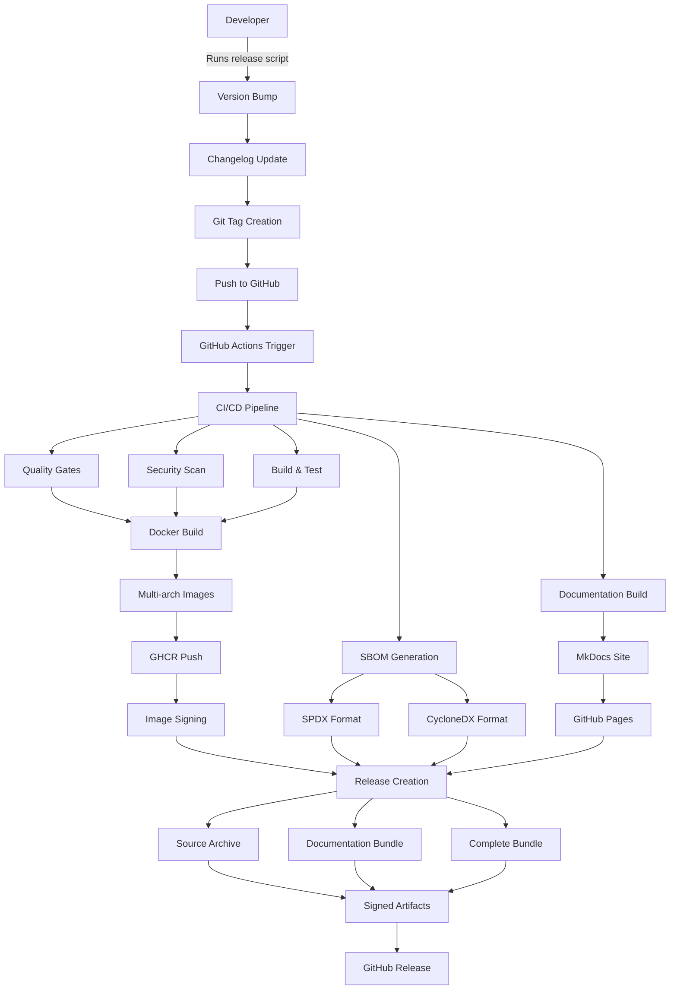

# Release & Sharing Workflow

This document describes the comprehensive release and sharing workflow implemented for the Image Generation Workspace, ensuring external AI agents can pull self-contained, versioned bundles with complete transparency.

## 🎯 Overview

The release workflow provides:

- **Version Tagging**: Semantic versioning with automated git tags
- **Docker Images**: Multi-architecture containers pushed to GitHub Container Registry (GHCR)
- **Documentation**: MkDocs site published to GitHub Pages with versioning
- **Release Bundles**: Zipped source snapshots with documentation attached to GitHub Releases
- **SBOM Generation**: Software Bill of Materials in both SPDX and CycloneDX formats for transparency
- **Security**: Cryptographically signed artifacts with Cosign

## 🏗️ Architecture



## 📦 Release Components

### 1. Docker Images

**Location**: GitHub Container Registry (ghcr.io)

- **Multi-architecture**: linux/amd64, linux/arm64
- **Signed**: Cosign signatures for verification
- **Tagged**: Version tags + latest
- **Optimized**: Multi-stage builds for minimal size

**Image naming**:
```
ghcr.io/your-username/image-generation-workspace:v1.2.3
ghcr.io/your-username/image-generation-workspace:latest
```

### 2. SBOM Files

**Formats**: SPDX-JSON and CycloneDX-JSON

Generated for complete transparency and security analysis:

- **SPDX**: Industry standard, NTIA compliant
- **CycloneDX**: OWASP standard with vulnerability data
- **Signed**: Cosign attestations
- **Attached**: To GitHub releases and container images

### 3. Documentation

**MkDocs Site**: Comprehensive, versioned documentation

- **URL**: `https://your-username.github.io/image-generation-workspace`
- **Versioned**: Mike for version management
- **Features**: Search, navigation, responsive design
- **Content**: API docs, guides, architecture diagrams

### 4. Release Bundles

**Self-contained packages** for AI agents and offline usage:

#### Source Archive
```
image-generation-workspace-v1.2.3-source.tar.gz
├── Complete git archive
├── All source code
├── Configuration files
└── Build scripts
```

#### Documentation Bundle
```
image-generation-workspace-v1.2.3-docs.tar.gz
├── Built MkDocs site
├── Static HTML files
├── Search indices
└── Assets
```

#### Complete Bundle
```
image-generation-workspace-v1.2.3-complete.tar.gz
├── docs/                    # Built documentation
├── sbom/                    # SBOM files
│   ├── sbom-spdx.json
│   └── sbom-cyclonedx.json
├── README.md
├── CONTRIBUTING.md
├── styleguides/
└── VERSION                  # Build metadata
```

### 5. Security Artifacts

- **Checksums**: SHA256 and SHA512 for all files
- **Signatures**: Cosign signatures for verification
- **Attestations**: SBOM attestations attached to images
- **Vulnerability Reports**: Security scan results

## 🚀 Usage

### For Developers

Create a new release:

```bash
# Patch release (1.0.0 → 1.0.1)
python scripts/release.py --bump patch

# Minor release (1.0.0 → 1.1.0)  
python scripts/release.py --bump minor

# Major release (1.0.0 → 2.0.0)
python scripts/release.py --bump major

# Custom version
python scripts/release.py 1.2.3

# Preview changes
python scripts/release.py --bump minor --dry-run
```

### For AI Agents

Pull complete, versioned bundles:

```bash
# Latest complete bundle
curl -L https://github.com/your-username/image-generation-workspace/releases/latest/download/image-generation-workspace-latest-complete.tar.gz

# Specific version
curl -L https://github.com/your-username/image-generation-workspace/releases/download/v1.2.3/image-generation-workspace-v1.2.3-complete.tar.gz

# Extract and verify
tar -xzf image-generation-workspace-v1.2.3-complete.tar.gz
cd release-bundle
cat VERSION  # Build metadata
```

### For Container Users

Pull signed images:

```bash
# Pull latest
docker pull ghcr.io/your-username/image-generation-workspace:latest

# Pull specific version
docker pull ghcr.io/your-username/image-generation-workspace:v1.2.3

# Verify signature (requires cosign)
cosign verify ghcr.io/your-username/image-generation-workspace:v1.2.3
```

## 🔍 Verification

### Verify Signatures

```bash
# Install cosign
curl -O -L "https://github.com/sigstore/cosign/releases/latest/download/cosign-linux-amd64"
sudo mv cosign-linux-amd64 /usr/local/bin/cosign
sudo chmod +x /usr/local/bin/cosign

# Verify container image
cosign verify ghcr.io/your-username/image-generation-workspace:v1.2.3

# Verify release artifact
cosign verify-blob --signature image-generation-workspace-v1.2.3-complete.tar.gz.sig image-generation-workspace-v1.2.3-complete.tar.gz
```

### Verify Checksums

```bash
# Download checksums
curl -L -O https://github.com/your-username/image-generation-workspace/releases/download/v1.2.3/checksums.sha256

# Verify integrity
sha256sum -c checksums.sha256
```

### Analyze SBOM

```bash
# View SBOM content
cat sbom/sbom-cyclonedx.json | jq '.components[] | {name: .name, version: .version}'

# Security analysis with syft
syft packages sbom/sbom-spdx.json

# Vulnerability scanning with grype
grype sbom:sbom/sbom-cyclonedx.json
```

## 🔐 Security Features

### Supply Chain Security

1. **Signed Commits**: GPG-signed git commits
2. **Signed Tags**: GPG-signed release tags  
3. **Signed Images**: Cosign container signatures
4. **Signed Artifacts**: Cosign blob signatures
5. **SBOM Attestations**: Attached to container images

### Transparency

1. **Complete SBOM**: All dependencies tracked
2. **Build Provenance**: GitHub Actions attestations
3. **Source Verification**: Git archive integrity
4. **Vulnerability Reports**: Automated security scanning

### Compliance

1. **NTIA Guidelines**: SBOM compliance
2. **SLSA Framework**: Supply chain security
3. **OWASP Standards**: Security best practices
4. **Industry Standards**: SPDX, CycloneDX formats

## 🛠️ Configuration

### GitHub Secrets Required

```yaml
# GitHub token (automatically provided)
GITHUB_TOKEN: ${{ secrets.GITHUB_TOKEN }}

# Optional: Custom signing key
COSIGN_PRIVATE_KEY: ${{ secrets.COSIGN_PRIVATE_KEY }}

# Optional: Security scanning tokens  
SEMGREP_APP_TOKEN: ${{ secrets.SEMGREP_APP_TOKEN }}
```

### Repository Settings

1. **GitHub Pages**: Enabled for documentation
2. **Container Registry**: Public access for images
3. **Actions**: Enabled with workflow permissions
4. **Branch Protection**: Main branch protection rules

## 📊 Monitoring

### Release Metrics

- Release frequency and cadence
- Bundle download statistics  
- Container image pulls
- Documentation page views
- Security scan results

### Quality Gates

- All tests pass
- Security scans clean
- Documentation builds successfully
- Images build for all architectures
- SBOM generation completes

## 🔄 Automation

### Triggers

1. **Manual**: Developer runs release script
2. **Tag Push**: Automated on git tag creation
3. **Schedule**: Optional nightly builds
4. **Webhook**: External trigger support

### Workflows

1. **CI/CD Pipeline**: `.github/workflows/ci-cd.yml`
2. **Documentation**: `.github/workflows/docs.yml`
3. **Security Scanning**: Integrated in main pipeline
4. **Release Creation**: Automated on tag push

## 📈 Future Enhancements

### Planned Features

1. **OCI Artifacts**: Helm charts as OCI packages
2. **Multi-registry**: Additional container registries
3. **Notarization**: macOS app notarization
4. **Windows Signing**: Code signing for Windows
5. **CDN Distribution**: Global artifact distribution

### Integration Options

1. **Package Managers**: Homebrew, Chocolatey, APT
2. **Cloud Marketplaces**: AWS, Azure, GCP
3. **Artifact Stores**: JFrog, Nexus integration
4. **Monitoring**: Grafana dashboards
5. **Security**: Integration with security platforms

## 🤖 AI Agent Integration

### Machine-Readable Metadata

Each release includes structured metadata for automated tools:

```json
{
  "version": "1.2.3",
  "build_date": "2025-01-XX",
  "git_commit": "abc123...",
  "docker_image": "ghcr.io/.../image-generation-workspace:v1.2.3",
  "sbom_files": ["sbom-spdx.json", "sbom-cyclonedx.json"],
  "documentation": "https://your-username.github.io/image-generation-workspace",
  "checksums": {
    "sha256": "...",
    "sha512": "..."
  }
}
```

### API Endpoints

- **Latest Release**: `https://api.github.com/repos/your-username/image-generation-workspace/releases/latest`
- **All Releases**: `https://api.github.com/repos/your-username/image-generation-workspace/releases`
- **Container Tags**: `https://ghcr.io/v2/your-username/image-generation-workspace/tags/list`

## 📞 Support

For questions about the release workflow:

- 📖 Documentation: [Release Documentation](docs/deployment/releases.md)
- 🐛 Issues: [GitHub Issues](https://github.com/your-username/image-generation-workspace/issues)
- 💬 Discussions: [GitHub Discussions](https://github.com/your-username/image-generation-workspace/discussions)
- 📧 Email: [team@example.com](mailto:team@example.com)

---

This release workflow ensures that external AI agents can reliably pull self-contained, versioned bundles with complete transparency and security verification.
