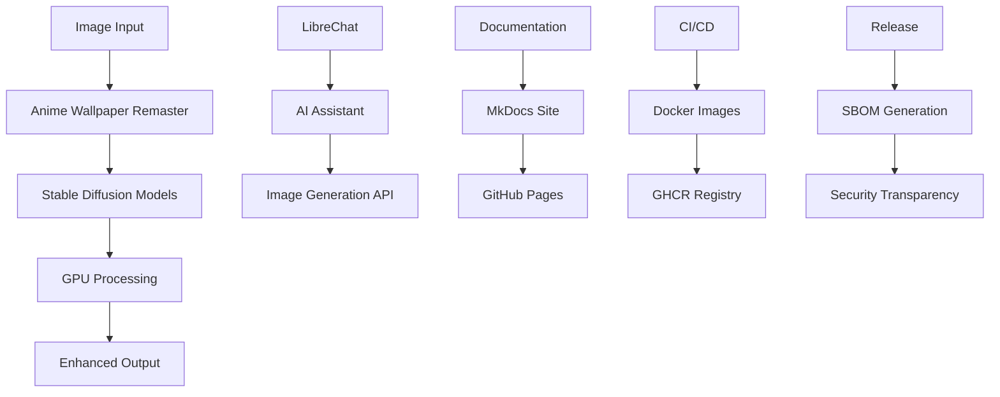

# Image Generation Workspace Documentation

Welcome to the comprehensive documentation for the Image Generation Workspace - a powerful collection of AI-powered image generation projects, tools, and resources.

## 🚀 Overview

This workspace contains multiple sophisticated projects focused on anime wallpaper remastering, stable diffusion models, and various AI-powered image processing applications.

**Key Features:**
- **AI-Powered Image Enhancement:** Advanced stable diffusion models for anime wallpaper remastering
- **GPU Memory Management:** Optimized for efficient GPU utilization
- **Multiple Quality Profiles:** Configurable enhancement levels
- **Comprehensive Testing:** Full test coverage and quality assurance
- **Docker Support:** Containerized deployment ready
- **Security-First:** Built with security best practices

## 📊 Repository Statistics

- **Total Files:** 2,231
- **Total Lines of Code:** 2,396,503
- **Total Size:** 63.9 GB
- **Primary Languages:** TypeScript/JavaScript, Python, CUDA
- **Docker Images:** Available on GitHub Container Registry
- **Documentation:** Versioned and continuously updated

## 🏗️ Architecture



## 🎯 Quick Start

### For Developers

1. **Clone the Repository**
   ```bash
   git clone <repository-url>
   cd image-generation-workspace
   ```

2. **Set up Development Environment**
   ```bash
   cd anime-wallpaper-remaster
   python install.py
   ```

3. **Run with Docker**
   ```bash
   docker-compose up
   ```

### For AI Agents

This repository provides comprehensive machine-readable metadata for AI agents:

- **[Repository Map](artifacts/repo-map.json)** - Complete file structure and analysis
- **SBOM Files** - Software Bill of Materials for transparency
- **Release Bundles** - Self-contained versioned packages

## 📦 Latest Release

The latest release includes:

- ✅ **Docker Images** - Multi-architecture containers (linux/amd64, linux/arm64)
- ✅ **SBOM Files** - Both SPDX and CycloneDX formats
- ✅ **Documentation Bundle** - Complete offline documentation
- ✅ **Source Snapshot** - Git archive with all project files
- ✅ **Signed Artifacts** - Cosign-verified authenticity

## 🔐 Security & Transparency

We prioritize security and transparency:

- **STRIDE Threat Modeling** - Comprehensive security analysis
- **SBOM Generation** - Full software bill of materials
- **Signed Releases** - Cryptographically verified artifacts
- **Vulnerability Scanning** - Automated security checks
- **Code Quality** - Continuous quality monitoring

## 📚 Documentation Sections

| Section | Description |
|---------|-------------|
| [Getting Started](getting-started/overview.md) | Installation and setup guides |
| [Components](components/architecture.md) | Detailed component documentation |
| [API Reference](api/overview.md) | Complete API documentation |
| [Development](development/setup.md) | Development workflows and guidelines |
| [Deployment](deployment/docker.md) | Deployment guides and configurations |
| [Security](security/overview.md) | Security policies and best practices |

## 🛠️ Technology Stack

### Core Technologies
- **Python 3.11** - Primary development language
- **PyTorch** - Deep learning framework
- **Stable Diffusion** - AI image generation
- **FastAPI** - High-performance web framework
- **Docker** - Containerization platform

### DevOps & CI/CD
- **GitHub Actions** - Continuous integration and deployment
- **MkDocs Material** - Documentation generation
- **Cosign** - Artifact signing and verification
- **SBOM Tools** - Software bill of materials generation

### Monitoring & Security
- **Prometheus** - Metrics collection
- **Trivy** - Vulnerability scanning
- **Semgrep** - Static analysis
- **Bandit** - Python security linting

## 🤝 Contributing

We welcome contributions! Please see our [Contributing Guide](development/contributing.md) for details on:

- Development setup
- Code standards
- Testing requirements
- Pull request process

## 📄 License

See individual project LICENSE files for specific licensing information.

## 🔗 External Resources

- **[GitHub Repository](https://github.com/your-username/image-generation-workspace)**
- **[Docker Images](https://github.com/your-username/image-generation-workspace/pkgs/container/image-generation-workspace)**
- **[Issues & Support](https://github.com/your-username/image-generation-workspace/issues)**
- **[Releases](https://github.com/your-username/image-generation-workspace/releases)**

---

*Last updated: {{ git_revision_date_localized }}*
