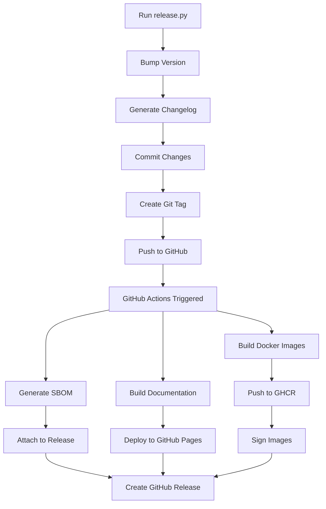

# Scripts Directory

This directory contains automation scripts for the Image Generation Workspace project.

## 📜 Available Scripts

### `release.py` - Release Automation

Automates the complete release process including version bumping, changelog generation, and git tagging.

#### Usage

```bash
# Automatic version bumping
python scripts/release.py --bump patch   # 1.0.0 → 1.0.1
python scripts/release.py --bump minor   # 1.0.0 → 1.1.0
python scripts/release.py --bump major   # 1.0.0 → 2.0.0

# Manual version specification
python scripts/release.py 1.2.3

# Dry run to preview changes
python scripts/release.py --bump minor --dry-run
```

#### What it does

1. **Version Management**
   - Reads current version from `pyproject.toml`
   - Bumps version according to semantic versioning
   - Updates version in project files

2. **Changelog Generation**
   - Analyzes git commits since last tag
   - Categorizes changes (Features, Bug Fixes, Documentation, etc.)
   - Updates `CHANGELOG.md` with structured entries

3. **Git Operations**
   - Creates annotated git tag
   - Commits changes with release message
   - Pushes tag and changes to origin

4. **CI/CD Trigger**
   - Tagged push triggers GitHub Actions
   - Automated build and release process
   - Docker image publishing
   - SBOM generation
   - GitHub Release creation

#### Prerequisites

- Clean git working directory
- Push access to the repository
- Python 3.8+ with required dependencies

#### Configuration

The script follows these conventions:

- **Semantic Versioning**: `MAJOR.MINOR.PATCH`
- **Tag Format**: `v{version}` (e.g., `v1.2.3`)
- **Commit Message**: `Release {version}`
- **Branch**: Pushes to `main` branch

## 🔄 Release Workflow

The complete release workflow involves:



## 🛠️ Development Scripts

### Adding New Scripts

When adding new scripts to this directory:

1. **Make them executable**:
   ```bash
   chmod +x scripts/new_script.py
   ```

2. **Add proper shebang**:
   ```python
   #!/usr/bin/env python3
   ```

3. **Include documentation**:
   - Purpose and usage
   - Prerequisites
   - Example commands

4. **Update this README**:
   - Add script to the available scripts list
   - Document usage and purpose

### Script Guidelines

- Use Python 3.8+ compatible syntax
- Include comprehensive error handling
- Provide clear success/failure feedback
- Support `--help` argument
- Use `argparse` for command-line interfaces
- Follow project coding standards

## 🔐 Security Considerations

- Scripts may modify git history and trigger deployments
- Always test with `--dry-run` first
- Ensure proper authentication for git operations
- Review changes before pushing to production

## 📋 Future Scripts

Planned automation scripts:

- `setup-dev.py` - Development environment setup
- `test-runner.py` - Comprehensive testing automation
- `security-scan.py` - Security vulnerability scanning
- `model-update.py` - AI model update automation
- `backup.py` - Repository and model backup utility

## 🤝 Contributing

When contributing new scripts:

1. Follow existing patterns and conventions
2. Add comprehensive documentation
3. Include error handling and validation
4. Test thoroughly before submission
5. Update this README with usage information

## 📞 Support

For questions about these scripts:

- Check the [main documentation](../docs/index.md)
- Review [contributing guidelines](../CONTRIBUTING.md)
- Open an issue for bugs or feature requests
